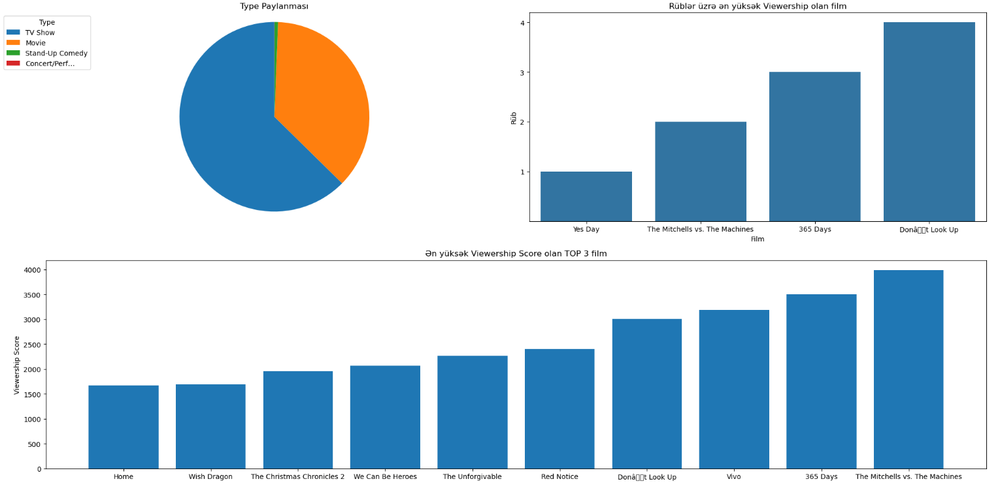

**Netflix Top 10 Movies Analysis**

📌 Layihə haqqında
Bu layihə Netflix-dəki filmlər və seriallar haqqında məlumatları analiz edir, vizuallaşdırır və istifadəçilərin baxış trendlerini araşdırır.

-Ən çox hansı filmlər ilk 10 film arasına girib?
-İstifadəçi reytinqlərinə görə ən yüksək 10 film hansıdır?
-Ən çox birinci yerdə qalan film
-Netflix Exclusive filmlər daha yüksək reytinqə sahibdir, yoxsa digərləri?
-Aylara görə ən məşhur Filmlər hansı olub?
-1/2/3/4 rübdə ən yüksək izləyici reytinqi olan 4 film hansı olub?

**Texnologiyalar / Kitabxanalar**

Hansı proqramlaşdırma dilləri və kitabxanalar istifadə olunub:

Python
Pandas
Matplotlib / Seaborn
NumPy
Jupyter Notebook

Layihə data analitika bacarıqlarının (data cleaning, data transformation, visualization, analysis) inkişaf etdirilməsi məqsədi ilə hazırlanmışdır.

